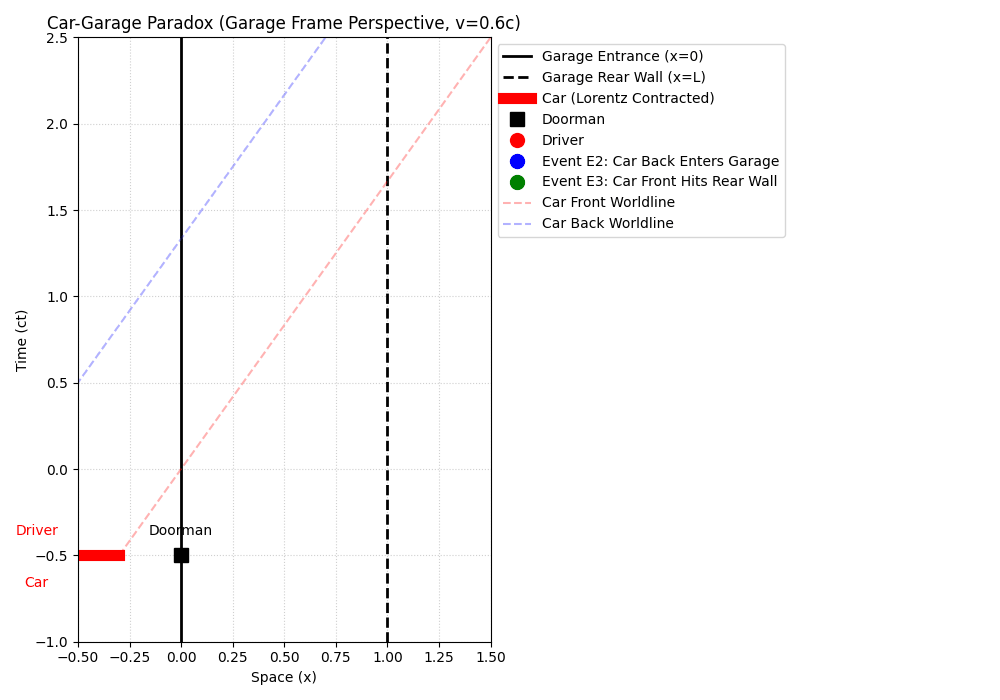
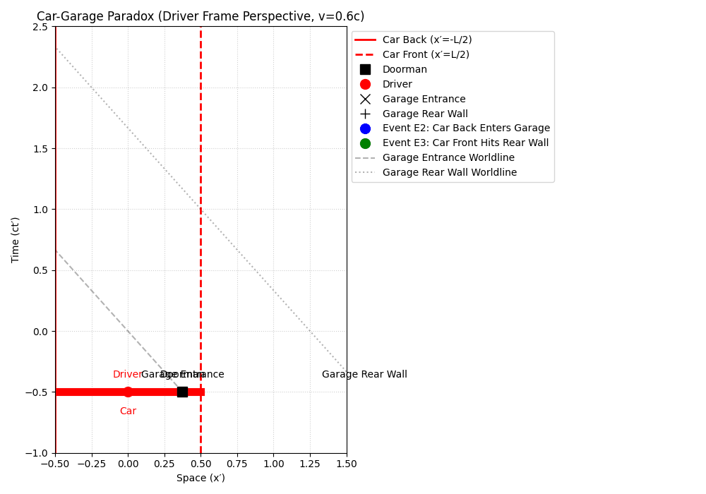

# 1. SPECIAL RELATIVITY - General Relativity (Robert M. Wald)

This folder contains exhaustive solutions and high-fidelity numerical simulations for Chapter 1 (and introductory problems) of Robert M. Wald's *General Relativity*.

## 🎥 Relativistic Benchmarks: Side-by-Side Comparison
The following simulations illustrate the **Relativity of Simultaneity** in the "Car and Garage" paradox. We compare how events A (Front Collision) and B (Rear Entry) are perceived across different inertial frames.

| **Garage Frame ($S$)** | **Car Frame ($S'$)** |
| :---: | :---: |
|  |  |
| *Simultaneity is preserved: The car fits via Lorentz Contraction ($L/\gamma < L$).* | *Simultaneity is destroyed: The car fits via staggered mechanical compression.* |

## 📄 Contents
*   **[WALD_PROBLEMS_1.pdf](./WALD_PROBLEMS_1.pdf):** Detailed analytical solutions focusing on the Minkowski metric signature $(+, -, -, -)$, Lorentz boosts, and the resolution of causality paradoxes.
*   **[Wald_Problem_1_Simulations.ipynb](./Wald_Problem_1_Simulations.ipynb):** Python notebook (Google Colab) featuring dynamic Minkowski diagrams, spacetime "tilting" visualizations, and numerical verification of the invariant interval.

## 🎯 Key Concepts & Deep Dives
- **Problem 1.1 - The Car and Garage Paradox:** 
    - **Lorentz Transformation:** Proof of $\Delta ct' = -\gamma\beta L$, showing that simultaneity is destroyed for the driver.
    - **Invariance Proof:** Mathematical verification that the Minkowski interval $s^2$ remains constant across frames.
- **Relativistic Fluid Dynamics:** 
    - **Energy-Momentum Tensor:** Modeling the car as a fluid with $T^{\mu\nu} = \rho_0 u^\mu u^\nu$.
    - **Conservation Laws:** Applying $\partial_\mu T^{\mu\nu} = 0$ to analyze the stress wave propagation.
- **Vanishing Rigidity:** Deep dive into why "perfect rigidity" is physically impossible in SR ($v_s > c$) and how causality is preserved through staggered signals.
- **Spacetime Topology:** Identification of light cones, worldlines, and the geometric interpretation of the Lorentz Boost.

---
*Part of the [Bra-ket Archive](https://github.com/Mau-Physics) project for PhD preparation.*

## 🎥 Video Explanations
Detailed walkthroughs and Manim animations for these relativistic problems:
1. [**Wald 1.1 - The Car & Garage Paradox: Resolving Causality**](TU_LINK_AQUÍ)
