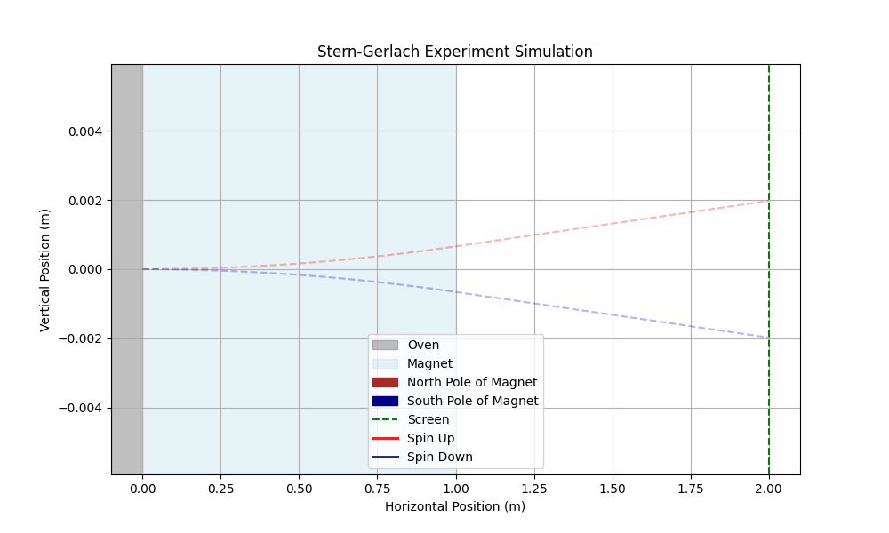
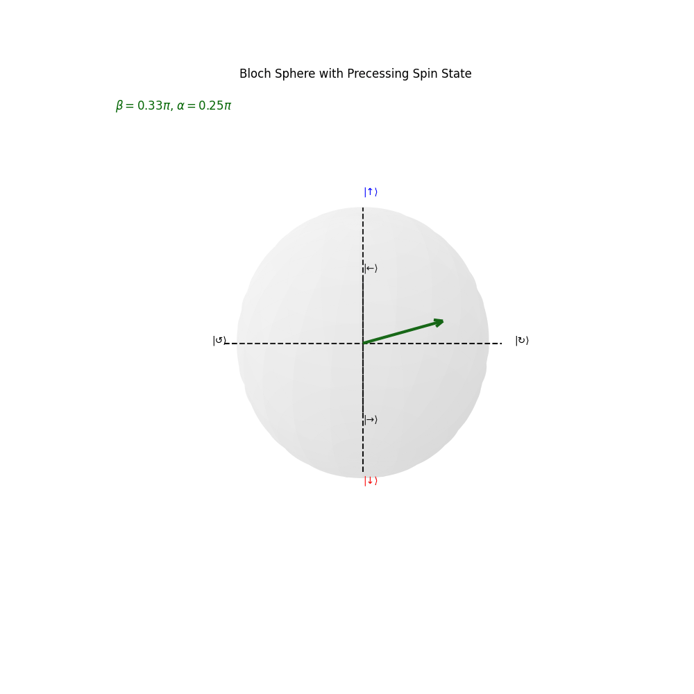
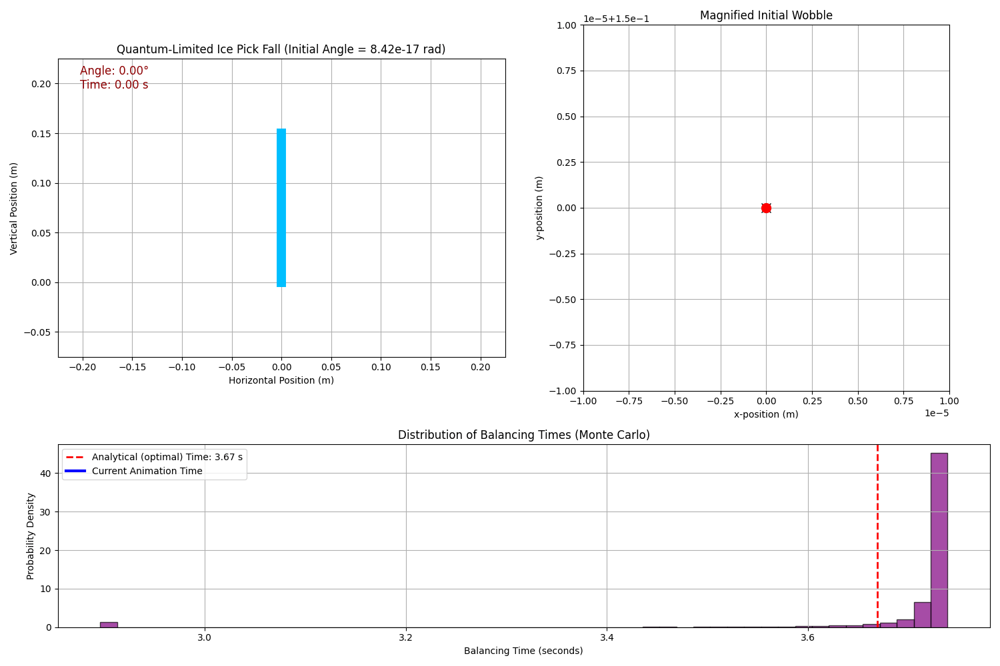
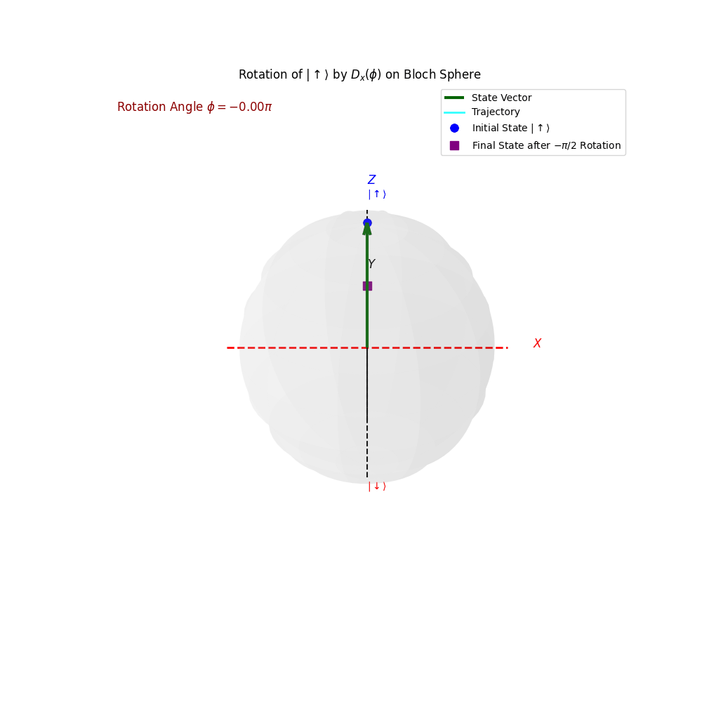
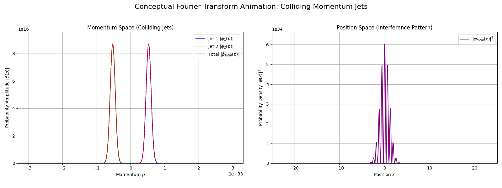
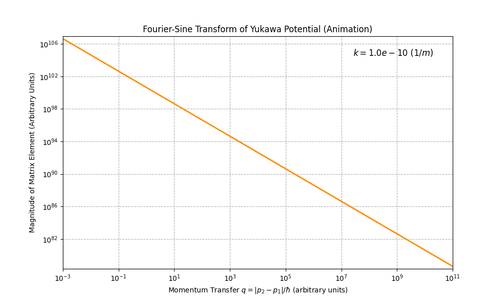
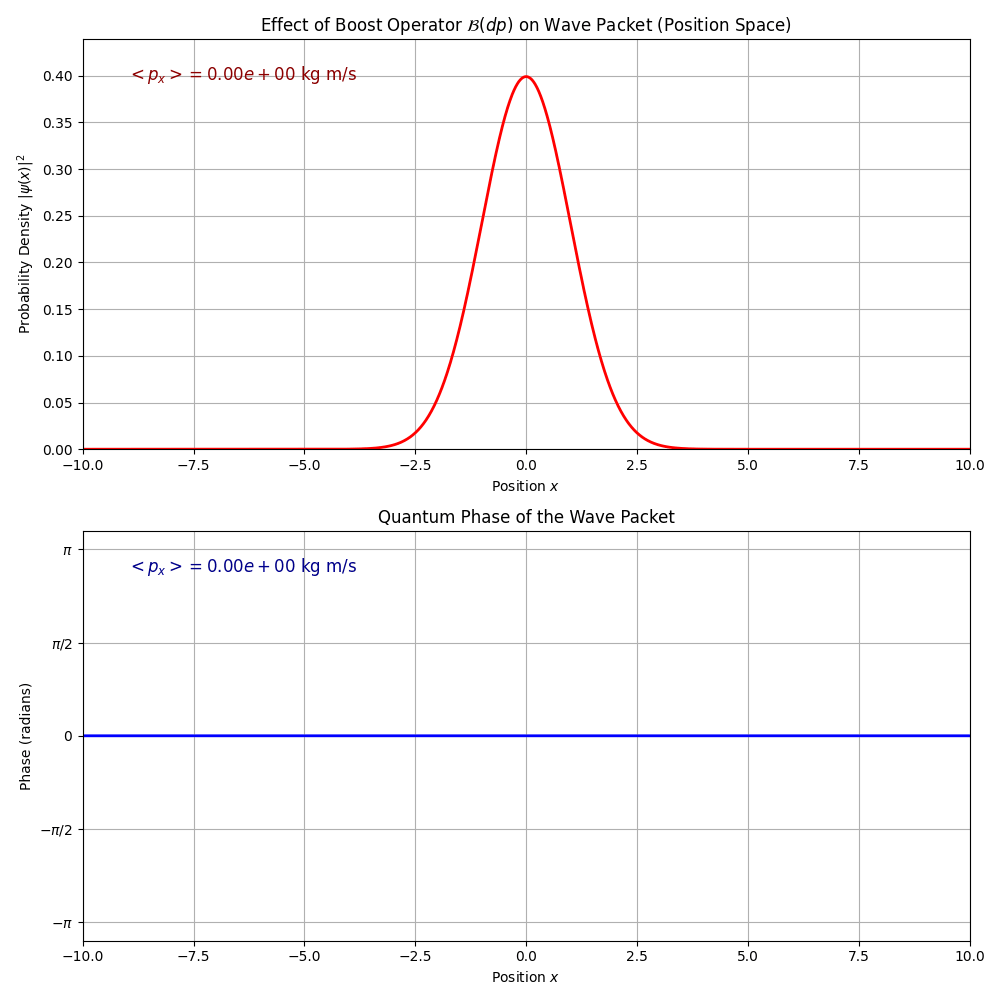

# 1. FUNDAMENTAL CONCEPTS - Modern Quantum Mechanics (J.J. Sakurai)

This folder contains exhaustive solutions and high-fidelity numerical simulations for Chapter 1 of J.J. Sakurai's *Modern Quantum Mechanics*.
> [!IMPORTANT]
> **PDF Preview Issue:** Due to the high density of LaTeX equations, Dirac bra-ket notation, and complex figures, the GitHub web viewer may fail to render the preview. For the full experience, please **download the file** or clone the repository.

## 📄 Contents
*   **[Modern_Quantum_Mechanics_Sakurai_Sol_Ch1.pdf](./Modern_Quantum_Mechanics_Sol.1_Fundamental_Concepts.pdf):** Detailed LaTeX solutions covering fundamental postulates, spin-$1/2$ systems, and bra-ket formalism.
*   **[Braket_Sakurai_1_Simulations.ipynb](./Braket_Sakurai_1_simulations.ipynb):** Python notebook (Google Colab) featuring continuous wave-packet propagation, spin-operator projections, and Bloch sphere trajectories.

## 🎯 Key Concepts & Interactive Simulations

The following highlights feature complete numerical implementations and visual assets demonstrating core quantum kinematics:

Problem & Description and Simulation Visual:

**Problem 1.1 - The Stern-Gerlach Experiment** Physical simulation of a silver atomic beam deflection splitting in an inhomogeneous magnetic field ($z$-axis). Acts as the foundational gateway to state quantization (pp. 2–3). 

**Problem 1.11 - Spinors in the $\hat{n}$ Direction** Three-dimensional projection in spherical coordinates of the arbitrary spin operator $\vec{\sigma}$ $\cdot$ $\hat{n}$. Visualizes expectation values across the angular manifold (pp. 16–17). 

**Problem 1.24 - The Quantum Ice Pick** Simulation of an inverted pendulum's intrinsic instability governed by Heisenberg's minimal uncertainty relation $\Delta x \Delta p \geq \hbar/2$ (pp. 38–39).

**Problem 1.26 - Spinor Rotations & Bloch Sphere Dynamics** Geometric animation tracking state vector trajectories across the Bloch Sphere under unitary rotation operators. Highly optimized for short-form visual explanations.

**Problem 1.29-b - 3D Scattering & Spherical Potentials** Continuous computational physics script solving the Fourier-Sine transform for spherical potentials to determine scattering amplitudes (p. 10).

**Problem 1.34 - The Boost Operator** Wave-packet dynamics experiencing an instantaneous momentum kick ( $𝐵(d𝐩′)=𝐈+𝑖𝐖⋅d𝐩′$ ). Demonstrates instantaneous velocity shifts without altering the spatial probability density.  

---
*Part of the [Bra-ket Archive](https://github.com/Mau-Physics) project for PhD preparation.*

## 🎥 Video Explanations
Detailed walkthroughs and animations for these conceptual deep dives:
1.  [**Sakurai 1.1 - Stern-Gerlach Mechanics**](YOUR_LINK_1)
2.  [**Sakurai1.11 - Spin Quantization**](YOUR_LINK_5)
3.  [**Sakurai 1.24 - The Quantum Ice Pick & Uncertainty Limits**](YOUR_LINK_2)
4.  [**Sakurai 1.26 - Visualizing the Bloch Sphere & Spin Rotations**](YOUR_LINK_3)
5.  [**Sakurai 1.34 - Galilean Boosts & Wave-Packet Kinematics**](YOUR_LINK_4)

---
*Follow the journey to Cambridge PhD at [Bra-Ket Archive](https://www.youtube.com/channel/UCU8PBiOcpkLhV0_TMgYx2vg)*
